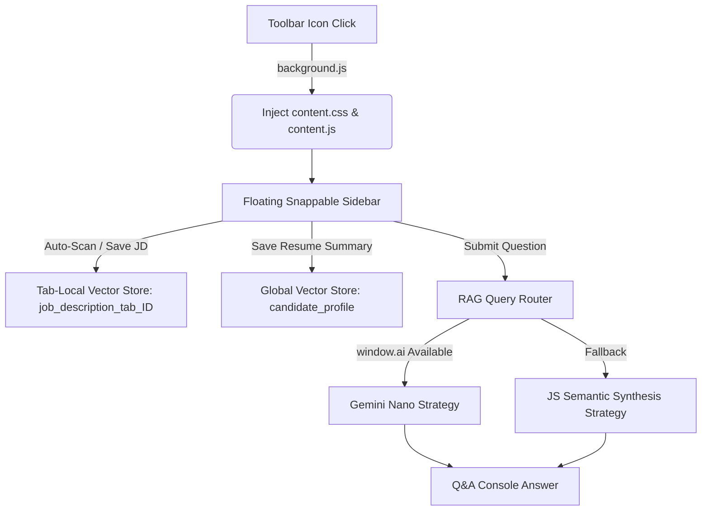

# Easy Apply Assistant: Local Vector Search & RAG Extension

Easy Apply Assistant is a developer-centric, high-performance Chrome Extension built with Manifest V3 that helps job seekers automate job description scanning, compute alignment scores, outline matching requirements, and perform interactive context-aware Q&A. 

All embedding generations, vector database operations, and text synthesis algorithms run **locally and completely offline** inside the browser tab context, requiring zero external server dependencies, API keys, or subscriptions.

---

## 🚀 Key Features

* **Draggable & Snappable Sidebar**: A floating glassmorphic sidebar panel. Drag it by the header to snap it to either the left or right of the screen. Drag the inner border resize handle to shrink or expand the panel width between `280px` and `600px`.
* **Zero-API-Key Local RAG**:
  * **Embeddings**: Uses Hugging Face `@huggingface/transformers` to run the `all-MiniLM-L6-v2` sentence-similarity model in-browser. The ~90MB model downloads once on first launch and caches inside Chrome Cache Storage for total offline use.
  * **Vector Database**: A simulated in-browser **ChromaDB emulator** (`chromadb.js`) written in OOPS-compliant JavaScript that runs vector queries via Cosine Similarity, persisted in `chrome.storage.local`.
* **Strategy Pattern Text Synthesis**:
  * **Primary (Gemini Nano)**: Uses Chrome's built-in `window.ai.languageModel` if enabled on the user's browser.
  * **Fallback (Semantic Synthesis)**: A custom pure-JS semantic RAG synthesis compiler that extracts key requirements, matches text similarity scores, identifies gap suggestions, and synthesizes direct answers.
* **Smart Data Scoping**:
  * **User Profile**: Shared globally across all browser tabs. Saving a new profile wipes the old candidate collection completely to keep exactly one active candidate profile.
  * **Job Description**: Isolated per tab using the tab ID (`lastScannedJD_tab_${tabId}` and `job_description_tab_${tabId}`). This enables comparing multiple job opportunities concurrently in separate tabs without cross-tab context pollution or overwrites.
* **Auto-Scan JD**: Target page scanning for LinkedIn, Naukri, and Workday job boards. Automatically outlines requirements on the page, pastes text into the editor, and syncs vectors.

---

## 📂 Project Architecture



### Module Breakdown:
* [manifest.json](file:///c:/Extension/easy-apply-job/manifest.json): Configuration file specifying permission scopes (`storage`, `activeTab`, `scripting`), CSP rules for `wasm-unsafe-eval` execution, and bundling.
* [background.js](file:///c:/Extension/easy-apply-job/background.js): Injection coordinator that listens for toolbar icon clicks and responds with the current tab ID.
* [content.js](file:///c:/Extension/easy-apply-job/content.js): Sidebar DOM injector, drag-and-resize handler, click event listeners, page scanners, and context invalidation guard checker.
* [content.css](file:///c:/Extension/easy-apply-job/content.css): Vanilla CSS containing premium glassmorphic cards, Circular SVG progress rings, loaders, transition slide animations, and tab-docking layout states.
* [src/chromadb.js](file:///c:/Extension/easy-apply-job/src/chromadb.js): Modular collection wrapper mimicking ChromaDB Python API collections (supporting `add`, `query`, `delete`, and `get`).
* [src/embeddings.js](file:///c:/Extension/easy-apply-job/src/embeddings.js): Text splitting engine and `@huggingface/transformers` feature-extraction pipeline initializer.
* [src/rag.js](file:///c:/Extension/easy-apply-job/src/rag.js): RAG Strategy class pattern containing built-in Chrome AI prompting and pure JS keyword context answers.

---

## 🛠️ Installation & Setup (Developer Mode)

### Prerequisites
Make sure you have [Node.js](https://nodejs.org/) installed to compile dependencies.

### 1. Build Compiled Scripts
Run npm commands inside the project directory:
```bash
# Install dependencies
npm install

# Bundle background.js and content.js
npm run build
```

### 2. Load the Unpacked Extension
1. Open Google Chrome and go to `chrome://extensions/`.
2. Toggle **Developer mode** in the top-right corner to **On**.
3. Click **Load unpacked** in the top-left corner.
4. Select the project root folder: `c:\Extension\easy-apply-job\`.

---

## 🎯 Verification Guide

1. Navigate to a supported job listing (e.g. on [Naukri](https://www.naukri.com/) or [LinkedIn Jobs](https://www.linkedin.com/jobs/)).
2. Click the **Easy Apply** extension icon in your toolbar. The sidebar panel will slide in on the right.
3. Paste your Candidate Resume details inside the first accordion, and click **Save & Embed Profile** (Check badge changes to green `✓ Profile`).
4. Click **Auto-Scan JD** inside the second accordion (Verify requirements are highlighted on the page, text is auto-filled, and badge changes to green `✓ Job Desc`).
5. Open the **Alignment Analytics** panel to see your fit score percentage, matched strengths, and recommended profile modifications.
6. Open **Q&A Assistant**, type a question (e.g. *"Do I have experience in Salesforce?"*), and hit **Submit** to view local context answers.